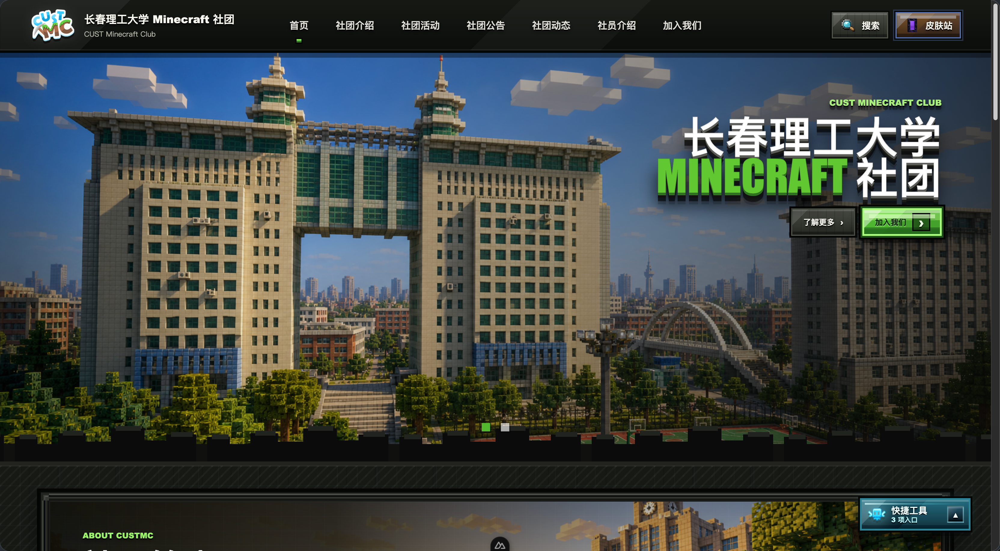

# 长春理工大学 Minecraft 社团官网

这是长春理工大学 Minecraft 社团官网项目，用于展示社团形象、发布活动公告、介绍服务器内容，并为游客、校内学生、潜在新成员和社员提供统一的公开访问入口。

项目采用 Nuxt 3 + Vue 3 + TypeScript 构建前台官网，内容后台第一阶段由 Strapi 5 承担。皮肤站、文档中心、Agent 服务等均作为外部或可选服务接入，官网本身不维护账号登录、权限审核或下载分发服务。

## 页面预览



## 功能概览

- 首页社团展示、Hero 轮播、近期活动、公告、动态、成员与作品展示
- 社团介绍页、活动列表与详情、公告列表与详情、动态列表与详情
- 社员介绍页、加入我们页、维护提示页和 404 页面
- 全站搜索浮层
- Header 皮肤站外部入口
- 快捷工具工作台面板
  - 文档中心：外部系统跳转入口
  - 悦灵助手：站内快捷工具，可选接入 Agent 服务
  - 服务状态：站内服务状态摘要
- Nuxt Server Routes 聚合公开内容接口，隔离 Strapi 原始 API
- Strapi 5 内容模型 schemas，便于快速搭建内容后台

## 技术栈

| 模块 | 技术 |
| --- | --- |
| 前端框架 | Nuxt 3 |
| UI 框架 | Vue 3 |
| 开发语言 | TypeScript |
| 样式 | Tailwind CSS + 自定义 CSS |
| 内容后台 | Strapi 5 |
| 内容数据库 | PostgreSQL，生产推荐 |
| 服务端接口 | Nuxt Server Routes / Nitro |

## 目录结构

```text
.
├── docs/                 # 产品、总体设计、详细设计、开发规范等文档
├── frontend/             # Nuxt 3 官网前台与公开 API 聚合层
│   ├── components/       # 页面组件与全站组件
│   ├── pages/            # Nuxt 页面路由
│   ├── server/api/       # Nuxt Server Routes
│   ├── server/utils/     # Strapi 适配与接口工具
│   ├── assets/css/       # 全站样式
│   └── types/            # 前台数据类型
├── strapi-models/        # Strapi 5 content-type 与 component schemas
├── scripts/              # 辅助脚本
├── openspec/             # OpenSpec 变更与规格文档
└── minecraft-photo-pixel-art/
```

## 快速开始

### 1. 安装依赖

```bash
cd frontend
npm install
```

### 2. 启动开发服务

```bash
npm run dev
```

默认访问地址通常为：

```text
http://localhost:3000
```

### 3. 类型检查

```bash
npm run typecheck
```

### 4. 构建生产包

```bash
npm run build
```

### 5. 本地预览生产构建

```bash
npm run preview
```

## 环境配置

Nuxt 运行配置位于 `frontend/nuxt.config.ts`。常用环境变量如下：

| 环境变量 | 默认值 | 说明 |
| --- | --- | --- |
| `NUXT_STRAPI_URL` | `http://localhost:1337` | Strapi API 基础地址 |
| `NUXT_STRAPI_API_TOKEN` | 空 | Strapi API Bearer Token |
| `NUXT_AGENT_SERVICE_URL` | 空 | 悦灵 Agent 服务地址，可选 |

文档中心地址不通过 Nuxt 环境变量配置，而是由 Strapi 的 `site-setting.documentCenterUrl` 维护，并通过 `GET /api/public/settings` 返回给前端。

生产环境不要将真实 Token、后台密码或私有服务地址提交到仓库。

## Strapi 内容模型

`strapi-models/` 目录提供了 Strapi 5 的 content-type 与 component schemas。

复制到 Strapi 项目：

```bash
cp -R strapi-models/src/* /path/to/your/strapi-project/src/
```

然后在 Strapi 项目中重启开发服务：

```bash
npm run develop
```

已覆盖的主要模型包括：

- `site-setting`
- `home-page`
- `about-page`
- `join-page`
- `activity`
- `announcement`
- `club-post`
- `member-profile`
- `gallery-item`
- `tag`

更多说明见 `strapi-models/README.md`。

## 公开接口

前台通过 Nuxt Server Routes 读取公开内容，避免页面直接依赖 Strapi 原始接口。

主要接口：

- `GET /api/public/settings`
- `GET /api/public/home`
- `GET /api/public/about`
- `GET /api/public/activities`
- `GET /api/public/activities/:slug`
- `GET /api/public/announcements`
- `GET /api/public/announcements/:slug`
- `GET /api/public/posts`
- `GET /api/public/posts/:slug`
- `GET /api/public/members`
- `GET /api/public/join`
- `GET /api/public/maintenance`
- `GET /api/agent/status`

## 外部服务边界

- 皮肤站是独立外部系统，官网仅提供 Header 跳转入口。
- 文档中心是独立外部系统，官网仅在快捷工具工作台中提供跳转入口。
- 内容后台由 Strapi Admin 独立承担，管理员直接访问后台。
- 官网不提供账号注册、登录、社员权限、在线报名审核或文件下载分发。
- 悦灵助手的真实 Agent 对话服务为可选接入；未配置时前端展示不可用提示。

## 开发脚本

在 `frontend/` 目录下可用：

| 命令 | 说明 |
| --- | --- |
| `npm run dev` | 启动 Nuxt 开发服务 |
| `npm run build` | 构建生产版本 |
| `npm run preview` | 预览生产构建 |
| `npm run typecheck` | 运行 Nuxt / Vue / TypeScript 类型检查 |

## 文档索引

- `docs/产品需求文档.md`
- `docs/总体设计文档.md`
- `docs/详细设计文档.md`
- `docs/开发规范文档.md`
- `docs/自研后台设计文档.md`
