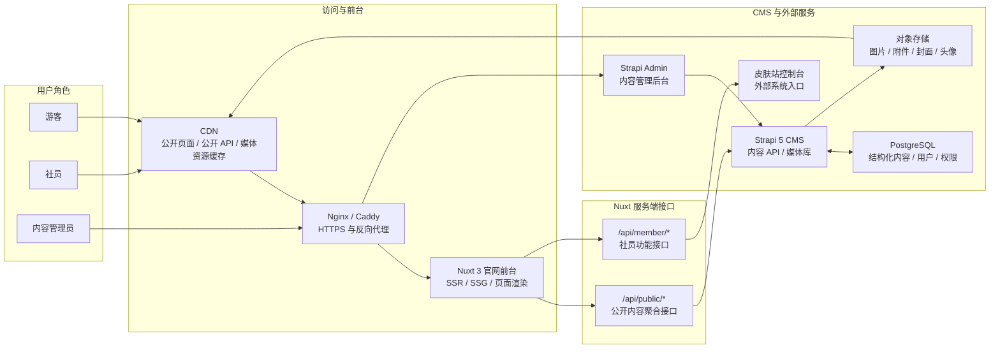

# 长春理工大学 Minecraft 社团官网总体设计文档

## 1. 技术栈选型

### 1.1 前端技术栈

| 类型 | 选型 | 用途 |
| --- | --- | --- |
| 前端框架 | Nuxt 3 | 官网 SSR/SSG、路由、SEO、服务端接口聚合 |
| UI 框架 | Vue 3 | 页面与组件开发 |
| 开发语言 | TypeScript | 类型约束与工程可维护性 |
| 样式方案 | Tailwind CSS + 自定义 CSS | 响应式布局、像素风视觉系统 |
| 无样式组件 | Reka UI | 弹窗、菜单、Tabs、Tooltip 等可访问交互组件 |
| 图标 | Lucide Icons + 自定义 SVG | 通用图标与像素风装饰图标 |
| 内容渲染 | Markdown / 富文本渲染组件 | 社团动态、公告、活动详情正文渲染 |

前台官网重点实现自定义像素风视觉。像素风主要通过 HTML + CSS 实现，SVG 用于图标、边框、地形边缘等可复用装饰素材，PNG/WebP 用于 Hero 背景、活动封面和相册图片。

### 1.2 后端与 CMS 技术栈

| 类型 | 选型 | 用途 |
| --- | --- | --- |
| CMS | Strapi 5 | 第一阶段内容后台、内容模型、媒体库、草稿发布 |
| 数据库 | PostgreSQL | Strapi 内容数据与用户权限数据存储 |
| 公开 API 层 | Nuxt Server Routes / Nitro | `/api/public/*` 聚合接口，隔离 Strapi 原始 API |
| 社员 API 层 | Nuxt Server Routes / Nitro | 社员中心、皮肤站控制台入口 |

第一阶段通过自有公开 API 连接官网前台与 CMS，接口边界详见 [详细设计文档](./详细设计文档.md)。自研后台设计详见 [自研后台设计文档](./自研后台设计文档.md)。

### 1.3 中间件与基础设施

| 类型 | 选型 | 用途 |
| --- | --- | --- |
| 反向代理 | Nginx 或 Caddy | HTTPS、域名转发、静态资源代理 |
| 缓存 | CDN + HTTP Cache-Control | 公开页面、公开 API、图片资源缓存 |
| 对象存储 | S3 兼容对象存储 | 图片、附件、资源文件存储 |
| 容器化 | Docker Compose | 本地与服务器部署编排 |
| 日志 | Docker logs / 基础文件日志 | 第一阶段运行日志 |
| Redis | 暂不引入 | 后续用于服务端缓存、队列、限流、Session 等 |

第一阶段不强制引入 Redis。公开访问性能主要依赖 CDN、HTTP 缓存、图片压缩和首页聚合接口。

## 2. 整体架构图

### 2.1 连线关系说明

- 游客、社员访问官网：`游客/社员 -> CDN -> Nginx/Caddy -> Nuxt 3 官网前台`。
- 内容管理员访问后台：`内容管理员 -> Nginx/Caddy -> Strapi Admin -> Strapi 5 CMS`。
- 公开内容读取：`Nuxt 3 官网前台 -> /api/public/* -> Strapi 5 CMS`。
- 社员功能访问：`Nuxt 3 官网前台 -> /api/member/* -> 皮肤站控制台`。
- CMS 结构化数据存储：`Strapi 5 CMS <-> PostgreSQL`。
- CMS 媒体资源存储：`Strapi 5 CMS -> 对象存储`。
- 媒体资源缓存访问：`对象存储 -> CDN`。

### 2.2 架构图



前端职责：

- 负责页面结构、视觉风格、响应式适配和交互体验。
- 通过聚合接口获取公开内容，接口细节见详细设计文档。
- 像素风视觉主要由自定义 CSS 和设计变量实现。

后端职责：

- Strapi 负责第一阶段内容建模、内容管理、媒体库和草稿发布。
- Nuxt Server Routes 负责公开内容聚合、字段裁剪、缓存控制和接口稳定。
- PostgreSQL 存储 CMS 内容、用户和权限数据。
- 对象存储保存图片、附件和资源文件。

## 3. 第一阶段部署组成

```text
custmc-web        Nuxt 3 官网前台与聚合 API
custmc-cms        Strapi 5 内容后台
custmc-db         PostgreSQL 数据库
custmc-proxy      Nginx 或 Caddy 反向代理
object-storage    S3 兼容对象存储
cdn               静态资源与公开内容缓存
```

第一阶段推荐通过 Docker Compose 编排服务。生产环境不建议使用 SQLite，Strapi 应连接 PostgreSQL。
