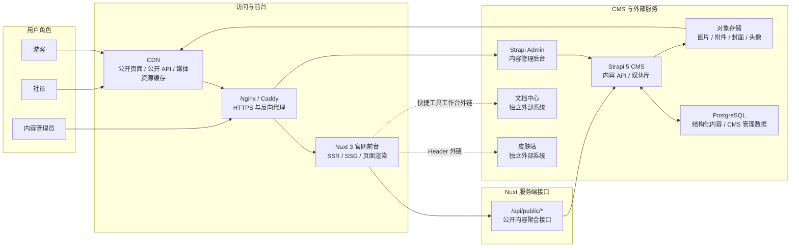

# 长春理工大学 Minecraft 社团官网总体设计文档

## 1. 技术栈选型

### 1.1 前端技术栈

| 类型 | 选型 | 用途 |
| --- | --- | --- |
| 前端框架 | Nuxt 3 | 官网 SSR/SSG、路由、SEO、服务端接口聚合 |
| UI 框架 | Vue 3 | 页面与组件开发 |
| 开发语言 | TypeScript | 类型约束与工程可维护性 |
| 样式方案 | Tailwind CSS + 自定义 CSS | 响应式布局、像素风视觉系统 |
| 无样式组件 | Reka UI | 弹窗、菜单、Tabs、Tooltip 等可访问交互组件 |
| 图标 | Lucide Icons + 自定义 SVG | 通用图标与像素风装饰图标 |
| 内容渲染 | Markdown / 富文本渲染组件 | 社团动态、公告、活动详情正文渲染 |

前台官网重点实现自定义像素风视觉。像素风主要通过 HTML + CSS 实现，SVG 用于图标、边框、地形边缘等可复用装饰素材，PNG/WebP 用于 Hero 背景、活动封面和相册图片。

### 1.2 后端与 CMS 技术栈

| 类型 | 选型 | 用途 |
| --- | --- | --- |
| CMS | Strapi 5 | 第一阶段内容后台、内容模型、媒体库、草稿发布 |
| 数据库 | PostgreSQL | Strapi 内容数据和 CMS 内部管理数据存储 |
| 公开 API 层 | Nuxt Server Routes / Nitro | `/api/public/*` 聚合接口，隔离 Strapi 原始 API |

第一阶段通过自有公开 API 连接官网前台与 CMS，接口边界详见 [详细设计文档](./详细设计文档.md)。自研后台设计详见 [自研后台设计文档](./自研后台设计文档.md)。

### 1.3 中间件与基础设施

| 类型 | 选型 | 用途 |
| --- | --- | --- |
| 反向代理 | Nginx 或 Caddy | HTTPS、域名转发、静态资源代理 |
| 缓存 | CDN + HTTP Cache-Control | 公开页面、公开 API、图片资源缓存 |
| 对象存储 | S3 兼容对象存储 | 图片、附件、资源文件存储 |
| 容器化 | Docker Compose | 本地与服务器部署编排 |
| 日志 | Docker logs / 基础文件日志 | 第一阶段运行日志 |
| Redis | 暂不引入 | 后续用于服务端缓存、队列、限流、Session 等 |

第一阶段不引入 Redis，也不实现服务端持久 last-known-good 缓存。公开访问性能主要依赖 CDN、HTTP 缓存、图片压缩和首页聚合接口；当 CDN 无可用缓存且 Strapi 不可用时，官网进入维护态，不使用 mock 数据兜底。

## 2. 整体架构图

### 2.1 连线关系说明

- 游客、社员访问官网：`游客/社员 -> CDN -> Nginx/Caddy -> Nuxt 3 官网前台`。
- 访问皮肤站：`游客/社员 -> 官网 Header 皮肤站按钮 -> 皮肤站外部系统`。
- 访问文档中心：`游客/社员 -> 官网快捷工具工作台 -> 文档中心外部系统`。
- 内容管理员访问后台：`内容管理员 -> Nginx/Caddy -> Strapi Admin -> Strapi 5 CMS`。
- 公开内容读取：`Nuxt 3 官网前台 -> /api/public/* -> Strapi 5 CMS`。
- CMS 结构化数据存储：`Strapi 5 CMS <-> PostgreSQL`。
- CMS 媒体资源存储：`Strapi 5 CMS -> 对象存储`。
- 媒体资源缓存访问：`对象存储 -> CDN`。

### 2.2 架构图



前端职责：

- 负责页面结构、视觉风格、响应式适配和交互体验。
- 通过聚合接口获取公开内容，接口细节见详细设计文档。
- 像素风视觉主要由自定义 CSS 和设计变量实现。

后端职责：

- Strapi 负责第一阶段内容建模、内容管理、媒体库和草稿发布。
- Nuxt Server Routes 负责公开内容聚合、字段裁剪、缓存控制和接口稳定。
- CDN 负责公开页面、公开 API、图片和附件的主要缓存；Nuxt 源站不在第一阶段维护 Redis 或持久 last-known-good 缓存。
- PostgreSQL 存储 CMS 内容和 CMS 内部管理数据。
- 对象存储保存图片、附件和资源文件。

## 3. 第一阶段部署组成

```text
custmc-web        Nuxt 3 官网前台与聚合 API
custmc-cms        Strapi 5 内容后台
custmc-db         PostgreSQL 数据库
custmc-proxy      Nginx 或 Caddy 反向代理
object-storage    S3 兼容对象存储
cdn               静态资源与公开内容缓存
```

第一阶段推荐通过 Docker Compose 编排服务。生产环境不建议使用 SQLite，Strapi 应连接 PostgreSQL。

## 4. 当前工程落地状态

本节记录当前仓库的工程实现状态，用于帮助后续 OpenSpec 变更、开发任务和文档同步判断影响范围。

### 4.1 目录落地

| 目录 | 当前职责 | 状态 |
| --- | --- | --- |
| `frontend/` | Nuxt 3 官网前台、页面路由、复用组件、聚合 API 和 Strapi 适配层 | 已建立 |
| `frontend/pages/` | 首页、公开列表/详情页、加入页、维护页等公开页面 | 已覆盖第一阶段主要页面 |
| `frontend/components/` | Header、Footer、Hero、内容卡片、详情正文、搜索浮层、服务状态、悦灵助手等组件 | 已建立 |
| `frontend/server/api/public/` | 公开内容聚合接口 | 已建立 |
| `frontend/server/api/agent/` | Agent 服务健康检查接口 | 已建立，可选接入 |
| `frontend/server/utils/strapi.ts` | Strapi API 访问和前台数据规范化 | 已建立 |
| `frontend/types/content.ts` | 前台标准数据类型 | 已建立 |
| `strapi-models/` | Strapi 5 content-type 和 component schemas | 已建立 |
| `scripts/` | 辅助脚本，例如 Strapi 测试数据导入 | 已建立 |
| `minecraft-photo-pixel-art/` | Minecraft 像素风图片生成与视觉资产相关内容 | 已建立 |

### 4.2 已实现接口边界

公开接口已覆盖：

- `GET /api/public/settings`
- `GET /api/public/home`
- `GET /api/public/about`
- `GET /api/public/activities`
- `GET /api/public/activities/:slug`
- `GET /api/public/announcements`
- `GET /api/public/announcements/:slug`
- `GET /api/public/posts`
- `GET /api/public/posts/:slug`
- `GET /api/public/members`
- `GET /api/public/join`
- `GET /api/public/maintenance`

可选外部服务接口已覆盖：

- `GET /api/agent/status`

### 4.3 运行配置

当前 Nuxt 工程通过 `runtimeConfig` 读取下列配置：

| 配置项 | 当前默认值 | 用途 |
| --- | --- | --- |
| `strapiUrl` | `http://localhost:1337` | Strapi API 基础地址 |
| `strapiApiToken` | 空字符串 | 访问 Strapi API 的 Bearer Token，可按环境配置 |
| `agentServiceUrl` | 空字符串 | 悦灵 Agent 外部服务地址，可选配置 |

文档中心地址不通过 Nuxt `runtimeConfig` 配置，而是由 Strapi `SiteSettings.documentCenterUrl` 维护，并通过 `GET /api/public/settings` 返回给前端。

生产环境应通过环境变量或部署平台配置覆盖默认值，不应在代码中写入生产密钥、Token 或真实后台密码。

### 4.4 当前约束与待接入项

- 当前前端页面已经改为通过 Nuxt Server Routes 获取数据，不直接访问 Strapi 原始 API。
- 当前 Strapi schemas 已覆盖第一阶段内容模型，但生产 Strapi 实例、PostgreSQL、对象存储和 CDN 仍需要在部署环境中配置。
- 当前官网不提供账号注册、登录、会话或社员角色权限服务。
- 当前皮肤站作为 Header 公开外链入口处理，不嵌入、不代理、不管理其业务数据。
- 当前文档中心作为快捷工具工作台中的公开外部工具入口处理，不嵌入、不代理、不管理其业务数据；未配置地址时前端展示禁用态。
- 当前内容后台由 Strapi Admin 独立承担，管理员直接访问后台，不通过官网中转。
- 当前服务状态由站点配置维护；真实 Minecraft 服务器在线状态查询仍属于后续能力。
- 当前悦灵助手只完成前端入口、健康检查和占位对话；真实 Agent 对话服务仍待接入。
